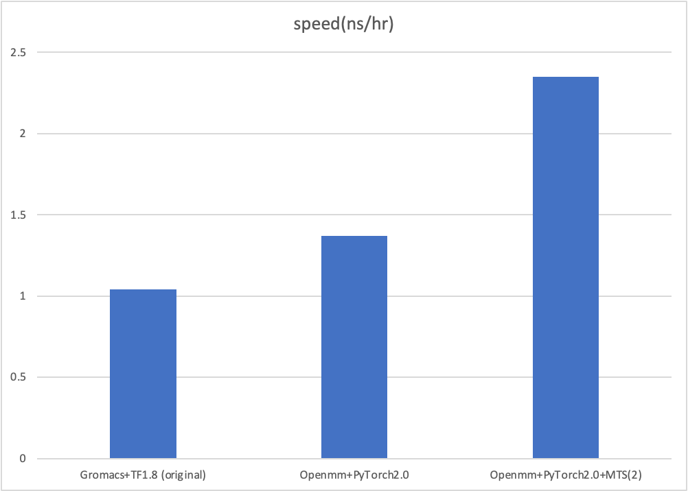

# Openrid: Reinforced Dynamics Built from OpenMM & PyTorch

**WARNING: Packages are still under development and not well tested. Please use with caution.**

## Features

* Parallel tempering sampling for different walkers
* At least 20% improvement compared to Gmx+TF
* Easy installation, one command

## Quick Start
There is an example in `example` folder, run the script below to see if it works.
You can modify the `ala2.yaml` file to change the parameters.
```
cd example
python run.py
```

## Setup

```
mamba create -n rid_openmm -c conda-forge openmm-torch=1.1 pytorch=2=*cuda* parmed MDAnalysis mpi4py mpich mpi clusterutils openmmtools
```

If GLIBC doesn't work or you are working on SLURM cluster, try:
```
CONDA_OVERRIDE_CUDA=11.8 CONDA_OVERRIDE_GLIBC=2.35 mamba create -n rid_openmm -c conda-forge openmm-torch=1.1 pytorch=2=*cuda* parmed MDAnalysis mpi4py mpich mpi clusterutils openmmtools
```

If mamba doesn't work, change to `conda install/create`.

## installation

```
python setup.py install
```

## Speed Benchmarks

Tested on Chignolin system (one V100 GPU card)


